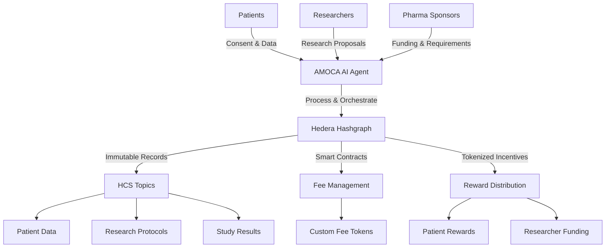

# AMOCA: Autonomous Medical Orchestration & Curation Agent

<div align="center">
  
  
  **Transforming Rare Disease Research Through Decentralized AI & Blockchain**
  
  [](https://hedera.com/)
  [](https://openai.com/)
  [](https://nextjs.org/)
  [](https://www.typescriptlang.org/)
</div>

---

## 🌟 Executive Summary

### The Challenge

Rare disease research is currently hampered by significant friction, high costs, and a lack of trust. Data is fragmented across inaccessible silos, patients are disconnected from the research process, and researchers struggle to secure funding and access quality data. For pharmaceutical and biotech companies, this environment creates immense financial risk, slowing the development of life-saving therapies for those who need them most.

### Our Solution

**AMOCA** (Autonomous Medical Orchestration & Curation Agent) is a decentralized framework designed to resolve these critical bottlenecks. By acting as an autonomous, AI-powered intermediary, AMOCA connects patients, researchers, and pharmaceutical sponsors in a transparent and efficient ecosystem. The platform empowers patients as sovereign owners of their data, provides researchers with streamlined access to funding and curated datasets, and offers sponsors a de-risked pathway to high-fidelity, real-world evidence.

### The Technology

The entire framework is built upon the **Hedera Hashgraph** public ledger, chosen specifically for its enterprise-grade security, high throughput, low-cost transactions, and definitive consensus. Hedera provides the immutable "trust layer" for all critical interactions—from patient consent to milestone-based payments—ensuring every action is auditable, transparent, and secure for all participants.

### The Vision

AMOCA represents a paradigm shift in rare disease research, transforming fragmented, siloed approaches into a transparent, incentivized, and patient-centric ecosystem. By leveraging Hedera's enterprise-grade infrastructure, advanced AI orchestration, and tokenized incentives, we create sustainable value for all stakeholders while accelerating the discovery and development of treatments for underserved patient populations.

---

## 🏗️ Architecture Overview



## 🚀 Key Features

### For Patients

- **🔐 Data Sovereignty**: Complete ownership and control over personal health data
- **💰 Incentivized Participation**: Token-based rewards for data contribution
- **🔒 Privacy-First**: Advanced PII sanitization and anonymization
- **✅ Granular Consent**: Fine-grained control over data usage permissions

### For Researchers

- **📊 Quality Data Access**: Curated, validated datasets for research
- **💳 Streamlined Funding**: Direct access to sponsor funding through smart contracts
- **🤖 AI-Powered Insights**: Advanced analytics and pattern recognition
- **⚡ Reduced Friction**: Automated processes for data acquisition and validation

### For Pharmaceutical Sponsors

- **📈 Real-World Evidence**: High-fidelity, real-world data for drug development
- **⚖️ De-Risked Investment**: Transparent, milestone-based funding mechanisms
- **🎯 Targeted Studies**: AI-matched patient cohorts for specific research needs
- **📋 Regulatory Compliance**: Built-in compliance with healthcare data regulations

---

## 🛠️ Technology Stack

### Core Infrastructure

- **Blockchain**: Hedera Hashgraph (HCS, HTS, Smart Contracts)
- **AI/ML**: OpenAI GPT-4, Custom ML pipelines
- **Backend**: Node.js, Hedera SDK
- **Frontend**: Next.js, React, TypeScript
- **Privacy**: Advanced PII detection and sanitization

### Key Components

- **🤖 AI Agent**: Conversational data collection and orchestration
- **🔗 Hedera Integration**: HCS topics, custom fees, token management
- **🛡️ Privacy Engine**: PII detection, anonymization, and consent management
- **💰 Token Economy**: Custom fee tokens, reward distribution, incentive alignment

---

## 📁 Project Structure

```
amoca-hip-991-ai-agent/
├── frontend-react/           # Next.js React frontend
│   ├── src/
│   │   ├── app/             # Next.js app router
│   │   │   ├── api/         # API routes
│   │   │   └── utils/       # Utility functions
│   │   └── components/      # React components
│   └── assets/              # Static assets
├── backend-hedera-contracts/ # Hedera smart contracts
│   ├── AMOCA-HTS.sol        # Token service contracts
│   ├── AMOCA-NFT.sol        # NFT contracts
│   └── AMOCA-storage-HEDERA.sol # Storage contracts
├── utils/                   # Node.js utilities
│   ├── client.js            # Hedera client configuration
│   ├── account.js           # Account management
│   ├── token.js             # Token operations
│   └── message.js           # Message handling
├── index.js                 # Main application entry
├── agent.js                 # AI agent implementation
└── README.md               # This file
```

---

## ⚡ Quick Start

### Prerequisites

- **Node.js** (v18+ recommended)
- **npm** or **yarn** package manager
- **Hedera Testnet Account** with HBAR
- **OpenAI API Key**

### 1. Installation

```bash
# Clone the repository
git clone https://github.com/manolaz/amoca-hip-991-ai-agent.git
cd amoca-hip-991-ai-agent

# Install dependencies
npm install

# Install frontend dependencies
cd frontend-react
npm install
cd ..
```

### 2. Environment Setup

Create a `.env` file in the root directory:

```env
# Hedera Configuration
OPERATOR_ADDRESS=0x...              # Your Hedera account address
OPERATOR_KEY=0x...                 # Your Hedera private key (ECDSA)
PAYER_ACCOUNT_ID=0.0.xxxxx         # Optional: Specific payer account
PAYER_PRIVATE_KEY=0x...            # Optional: Payer private key
PAYER_EVM_ADDRESS=0x...            # Optional: Payer EVM address

# OpenAI Configuration
OPENAI_API_KEY=sk-...              # Your OpenAI API key

# Application Configuration
NEXT_PUBLIC_DEFAULT_TOPIC_ID=0.0.xxxxx  # Optional: Default HCS topic
```

### 3. Running the Backend

```bash
# Start the core Hedera messaging system
node index.js
```

This will:

- Initialize Hedera client
- Create fee payer accounts
- Generate custom fee tokens
- Set up HCS topics with fees
- Start the message submission system

### 4. Running the AI Agent

```bash
# In a new terminal, start the AI agent
node agent.js <TOPIC_ID>
```

### 5. Running the Frontend

```bash
# In another terminal, start the Next.js frontend
cd frontend-react
npm run dev
```

Visit `http://localhost:3000` to access the AMOCA interface.

---

## 🧪 Usage Examples

### Patient Data Submission

```bash
# The AI agent will guide patients through data collection
# Example interaction flow:
1. Patient consents to data sharing
2. AI collects medical history step-by-step
3. Data is sanitized and anonymized
4. Final submission to Hedera with tokenized rewards
```

### Researcher Access

```bash
# Researchers can access curated datasets
1. Submit research proposal
2. Get matched with relevant patient cohorts
3. Receive funding through smart contracts
4. Access anonymized, research-ready datasets
```

### Sponsor Integration

```bash
# Pharmaceutical sponsors can fund and access studies
1. Define research requirements
2. Set funding parameters and milestones
3. Get matched with qualified researchers
4. Receive real-world evidence and study results
```

---

## 🔧 API Reference

### Core Endpoints

#### Patient Data Submission

```
POST /api/submit
Content-Type: application/json

{
  "payload": {
    "consent": true,
    "data": "patient input",
    "collected_data": {...},
    "conversation_history": [...]
  },
  "topicId": "0.0.xxxxx"
}
```

#### Response Format

```json
{
  "latestResponse": {
    "status": "COMPLETE",
    "collected_data": {...}
  },
  "hedera_status": "SUCCESS",
  "transactionId": "0.0.xxxxx-xxxxx-xxxxx",
  "workflow_details": {
    "fee_payer_account": "0.0.xxxxx",
    "fee_token": "0.0.xxxxx",
    "tokens_transferred": 100,
    "fee_per_message": 5,
    "workflow_complete": true
  }
}
```

---

## 🛡️ Security & Privacy

### Data Protection

- **PII Sanitization**: Automatic detection and removal of personally identifiable information
- **Encryption**: End-to-end encryption for sensitive data
- **Consent Management**: Granular consent tracking on Hedera
- **Access Control**: Role-based access to different data types

### Blockchain Security

- **Immutable Records**: All transactions recorded on Hedera Hashgraph
- **Consensus**: Fast, fair, and secure consensus mechanism
- **Audit Trail**: Complete transparency for all data interactions
- **Smart Contract Security**: Audited contracts for fee and reward management

---

## 🌱 Contributing

We welcome contributions from the community! Please see our [Contributing Guidelines](CONTRIBUTING.md) for details on:

- **Code Style**: TypeScript/JavaScript standards
- **Testing**: Unit and integration test requirements  
- **Documentation**: API and code documentation standards
- **Pull Requests**: Review process and requirements

---

## 📜 License

This project is licensed under the MIT License - see the [LICENSE](LICENSE) file for details.

---

## 🤝 Community & Support

### Get Involved

- **Discord**: Join our [AMOCA Community](https://discord.gg/amoca)
- **Twitter**: Follow [@AMOCAHealth](https://twitter.com/AMOCAHealth)
- **LinkedIn**: [AMOCA Company Page](https://linkedin.com/company/amoca)

### Support Channels

- **GitHub Issues**: Bug reports and feature requests
- **Documentation**: [docs.amoca.ai](https://docs.amoca.ai)
- **Email**: <support@amoca.ai>

---

## 🗺️ Roadmap

### Phase 1: Foundation (Q3 2025) ✅

- [x] Core AI agent implementation
- [x] Hedera integration with HCS
- [x] Basic privacy and PII protection
- [x] Token-based fee system

### Phase 2: Enhancement (Q4 2025)

- [ ] Advanced smart contracts deployment
- [ ] Multi-language support
- [ ] Enhanced privacy features
- [ ] Researcher portal

### Phase 3: Scale (Q1 2026)

- [ ] Pharmaceutical partner integration
- [ ] Regulatory compliance certifications  
- [ ] Multi-chain support
- [ ] Global deployment

### Phase 4: Evolution (Q2 2026)

- [ ] Advanced AI/ML capabilities
- [ ] Predictive analytics
- [ ] Real-world evidence generation
- [ ] Ecosystem partnerships

---

<div align="center">
  
**AMOCA** - *Advancing Medical Research Through Decentralized AI*

*Built with ❤️ for the rare disease community*

[Website](https://amoca.ai) • [Documentation](https://docs.amoca.ai) • [Community](https://discord.gg/amoca)

</div>
